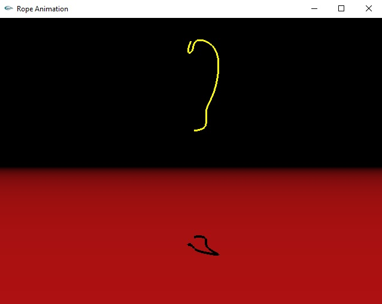

# RopeAnimation

This repo implements a physics based rope animation system. Cubic b-splines are used to model the contiouos mass along the rope. The animation is performed via forces acting on the control points of the spline.

## Code 

Dependencies: OpenGL, GLUT and LAPACK. 

## Algorithm details

The spline-based animation algorithm used in the program was introduced in [1]. The customization/derivation for the rope animation is explained in the .

[1] Rémion, Yannick, Jean-Michel Nourrit, and Didier Gillard. "Dynamic animation of spline like objects." Proceedings of the WSCG’1999 Conference. 1999. 

## Precompiled binaries

Precompiled binaries (Windows) are in bin folder. 

### Controls

Up - down - left - right: Pull the rope along the x-z plane

Page up - page down: Pull the rope along the y-coordinate

p: Show/hide control points

s - d - f - e - l - o: Camera motion

## License

Copyright (c) 2004, Oncel Tuzel

All rights reserved.

Redistribution and use in source and binary forms, with or without
modification, are permitted provided that the following conditions are met:

1. Redistributions of source code must retain the above copyright notice, this
   list of conditions and the following disclaimer.
2. Redistributions in binary form must reproduce the above copyright notice,
   this list of conditions and the following disclaimer in the documentation
   and/or other materials provided with the distribution.

THIS SOFTWARE IS PROVIDED BY THE COPYRIGHT HOLDERS AND CONTRIBUTORS "AS IS" AND
ANY EXPRESS OR IMPLIED WARRANTIES, INCLUDING, BUT NOT LIMITED TO, THE IMPLIED
WARRANTIES OF MERCHANTABILITY AND FITNESS FOR A PARTICULAR PURPOSE ARE
DISCLAIMED. IN NO EVENT SHALL THE COPYRIGHT OWNER OR CONTRIBUTORS BE LIABLE FOR
ANY DIRECT, INDIRECT, INCIDENTAL, SPECIAL, EXEMPLARY, OR CONSEQUENTIAL DAMAGES
(INCLUDING, BUT NOT LIMITED TO, PROCUREMENT OF SUBSTITUTE GOODS OR SERVICES;
LOSS OF USE, DATA, OR PROFITS; OR BUSINESS INTERRUPTION) HOWEVER CAUSED AND
ON ANY THEORY OF LIABILITY, WHETHER IN CONTRACT, STRICT LIABILITY, OR TORT
(INCLUDING NEGLIGENCE OR OTHERWISE) ARISING IN ANY WAY OUT OF THE USE OF THIS
SOFTWARE, EVEN IF ADVISED OF THE POSSIBILITY OF SUCH DAMAGE.

The views and conclusions contained in the software and documentation are those
of the authors and should not be interpreted as representing official policies,
either expressed or implied, of the FreeBSD Project.
